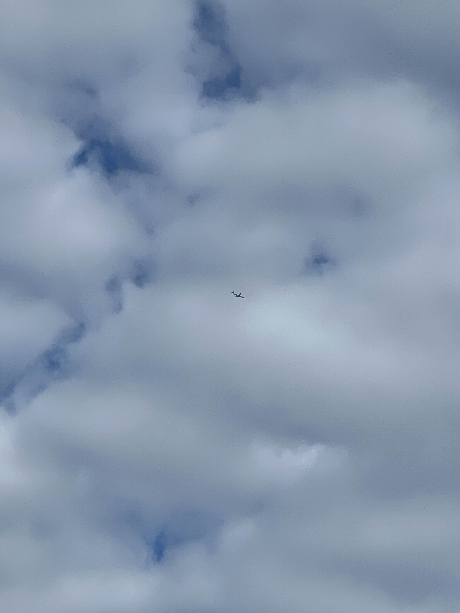

# Unit-Project-KF
<!DOCTYPE html>
<html>

<h2>Publishing is significant to me because it lets my ideas move the way nature moves around me.</h1>

  

  The ground represents where those ideas begin. In quiet places, shaped by what I observe and the paths I walk.
  Publishing helps me map those thoughts and make sense of where I’m going creatively.

  

  The sky reminds me that sharing my work gives it lift. Once it’s released, it can travel farther than I ever
  could on my own.

  

  The water shows how publishing creates reflection. When I put something into the world, I see it more clearly—
  how it changes, how people respond, and how it shapes me in return. Digital publishing matters because it connects
  these grounded moments to a wider horizon.

<h2>Publishing helps my ideas rise, take root, and ripple outward.</h2>

</body>
</html>
