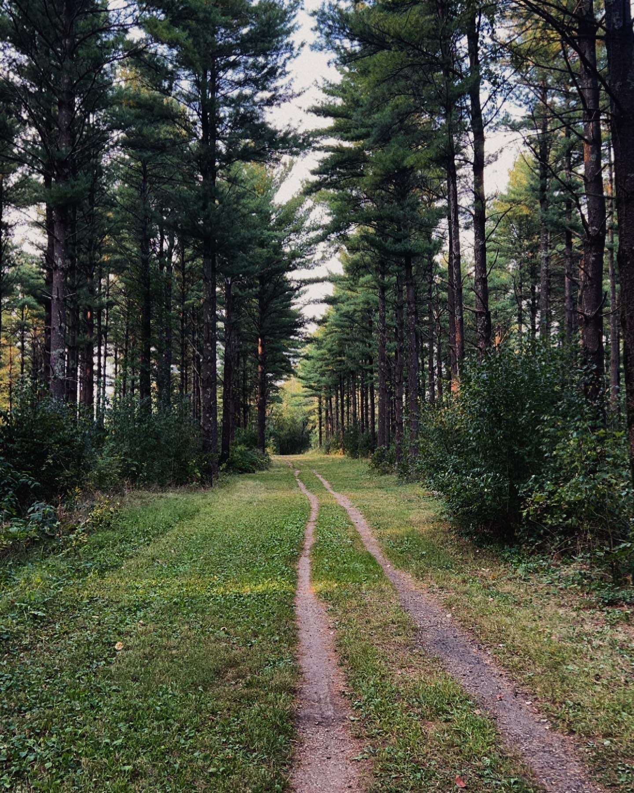

# Unit-Project-KF
<html>

<h2>Publishing is significant to me because it lets my ideas move the way nature moves around me.</h1>

  

  The ground represents where those ideas begin. In quiet places, shaped by what I observe and the paths I walk.
  Publishing helps me map those thoughts and make sense of where I’m going creatively.

